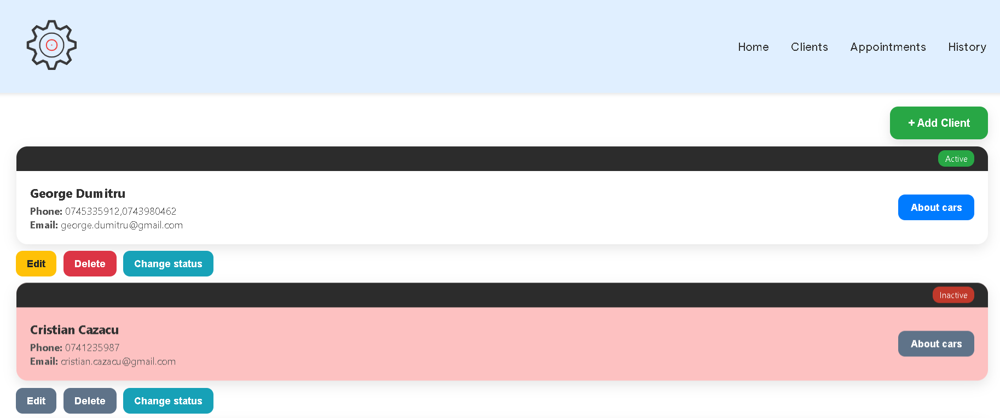
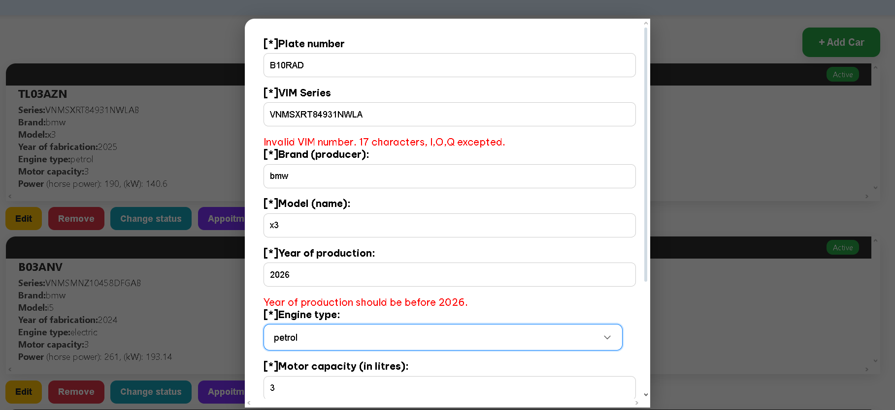
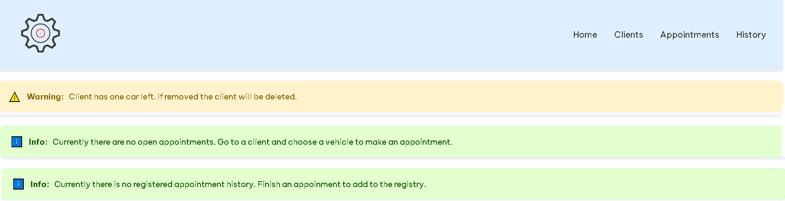

<h2>Frontend service auto: Angular</h2>

<h2>1.Initializare proiect</h>
<h5>Comenzi:</h5>
<ul>
    <li>npm install
    <li>npm start
    <li>"http://localhost:4200" in browser
</ul>

<h2>2.Functionalitati</h2>

Acest proiect implementeaza urmatoarele functionalitati:

<h3>Clienti</h3>
<ul>
    <li>Citirea, adaugarea, editarea, stergerea clientilor.
    <li>Dezactivarea contului unui client (pana la reactivare nu poate fi modificat si sunt sterse programarile sale).
    <li>La stergerea unui client programarile asociate vor fi sterse deasemenea.
    <li>Vizualizarea masinilor clientului.
</ul>
<h3>Masini</h3>
<ul>
    <li> Citirea, adaugarea, editarea, stergerea masinilor unui client.
    <li> La stergerea ultimei masini clientul este sters deasemenea. (Un client are minim o masina)
    <li>Dezactivarea masinii unui client(pana la reactivare nu poate fi modificata si sunt sterse programarile asociate ei).
    <li>La stergerea unei masini programarile asociate vor fi sterse deasemenea.
    <li>Realizarea unei programari pentru o masina.
    <li>Accesarea unei colectii de masini a unui client inactiv sau inexistent rezulta in redirectionarea catre pagina principala.
    <li>Validatori custom pentru completare optionala a campurilor: "cai putere" si "kW".
</ul>
<h3>Programari</h3>
<ul>
    <li> Citirea, adaugarea, editarea, stergerea unei programari.
    <li> Update pentru sosirea vehiculului la programare.
    <li> Update pentru procesarea vehiculului pe perioada programarii.
    <li> Trimiterea informatiilor catre istoric (create istoric).
    <li> Validatori custom pentru data si ora programarii.
</ul>
<h3>Istoric</h3>
<ul>
    <li> Citirea, editarea si stergerea istoricului.
</ul>
<h3>Generale</h3>
<ul>
    <li>Inputul utilizatorilor a fost validat in formulare.
    <li>Accesarea unei rute gresite/inexistente redirectioneaza catre pagina 404.
    <li>Salvarea datelor se face prin intermediul elementelor json salvate in localStorage (sunt initializate folosind data.ts).
    <li>Incarcare rapida a paginilor.
    <li>Stilizare realizata cu scss.
</ul>
<h3>Design</h3>

  
  Clients page

  
  Add car form

  
  Helpful messages for users (edited)

<h4>Anexe</h4>
- versiunea folosita de node se gaseste in "node.nvmrc"